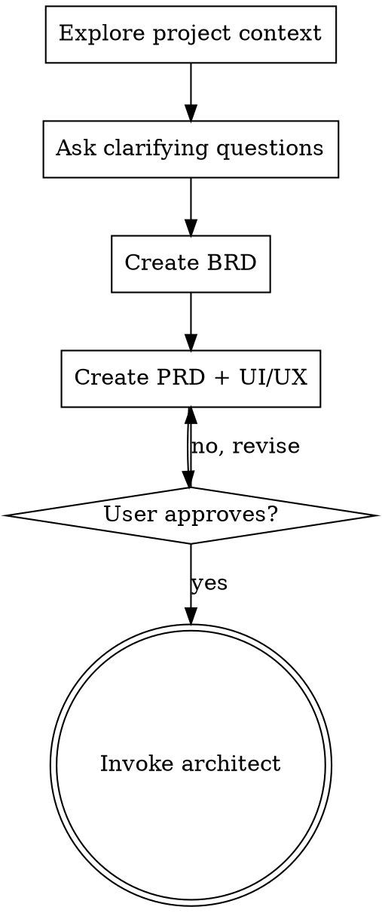

# Brainstorming: Ideas Into Designs

## Overview

**Phase 1-2 of Auto-Coding Framework**

Help turn ideas into fully formed designs and specs through natural collaborative dialogue.

<HARD-GATE>
Do NOT write any code, scaffold any project, or take any implementation action until:
1. You have completed the BRD (Business Requirements Document)
2. You have completed the PRD (Product Requirements Document)
3. User has approved both documents
</HARD-GATE>

## Anti-Pattern: "This Is Too Simple To Need A Design"

Every project goes through this process. A todo list, a single-function utility, a config change — all of them. "Simple" projects are where unexamined assumptions cause the most wasted work.

## Process Flow

**The terminal state is invoking the architect agent.** Do NOT start coding.

## Checklist

Complete these in order:

1. **Explore project context**
   - Check existing files, docs, recent commits
   - Understand current system architecture
   - Identify related components

2. **Ask clarifying questions**
   - One at a time, understand purpose/constraints/success criteria
   - Prefer multiple choice when possible
   - Focus on: purpose, constraints, success criteria

3. **Competitive Analysis** (if building a product with UI)
   - **⚠️ MANDATORY for UI projects: Invoke `competitive-analysis` skill**
   - Analyze at least 3 competitor websites
   - Extract: business logic, interaction logic, visual style
   - Present design options to user for selection
   - Output: Save to `docs/research/COMPETITIVE-ANALYSIS-{topic}.md`

4. **Create BRD** → `docs/brd/BRD-{project}.md`
   - Business objectives
   - User stories
   - Success metrics
   - Stakeholders
   - **⚠️ MANDATORY: Must reference competitive analysis output**
   - Include: Market context, competitive landscape, differentiation strategy
   - Document must cite: `docs/research/COMPETITIVE-ANALYSIS-{topic}.md`

5. **Create PRD** → `docs/prd/PRD-{project}.md`
   - **⚠️ MANDATORY: Invoke `prd-best-practices` skill first**
   - Use template from [.claude/skills/prd-best-practices/prd-template.md](.claude/skills/prd-best-practices/prd-template.md)
   - Review examples from [.claude/skills/prd-best-practices/prd-examples.md](.claude/skills/prd-best-practices/prd-examples.md)
   - Feature specifications
   - Acceptance criteria
   - UI/UX considerations
   - Technical constraints
   - **⚠️ MANDATORY: Must reference competitive analysis and BRD**
   - Include: User flow patterns from analysis, design direction recommendations
   - Document must cite:
     - `docs/research/COMPETITIVE-ANALYSIS-{topic}.md`
     - `docs/brd/BRD-{project}.md`

6. **Get user approval**
   - Present documents section by section
   - Revise based on feedback
   - Only proceed when explicitly approved

7. **Transition to Architecture**
   - Notify user that requirements are complete
   - Suggest invoking `architect` agent for Phase 3

## Output Files

| Document | Location | Purpose | Must Reference |
|----------|----------|---------|----------------|
| Competitive Analysis | `docs/research/COMPETITIVE-ANALYSIS-{topic}.md` | Market research | - |
| BRD | `docs/brd/BRD-{project}.md` | Business requirements | Competitive Analysis |
| PRD | `docs/prd/PRD-{project}.md` | Product requirements | Competitive Analysis, BRD |

## Key Principles

- **One question at a time** - Don't overwhelm
- **Multiple choice preferred** - Easier to answer
- **YAGNI ruthlessly** - Remove unnecessary features
- **Explore alternatives** - Propose 2-3 approaches before settling
- **Incremental validation** - Get approval after each section
- **Be flexible** - Go back and clarify when needed

## Integration with Auto-Coding Framework

| Phase | Agent | Output |
|-------|-------|--------|
| Phase 1 | business-analyst + market-researcher | BRD |
| Phase 2 | product-manager + ux-designer | PRD + UI/UX |
| Phase 3 | architect | Architecture Doc |
