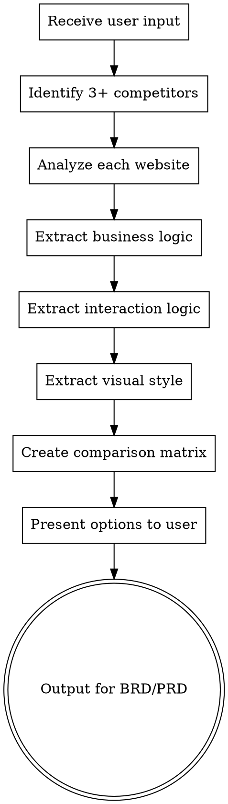

# Competitive Analysis: Website Research & Analysis

## Overview

**Mandatory skill for market-researcher when conducting competitive analysis**

This skill guides the systematic research and analysis of competitor websites to understand:
- **Business Logic**: How they make money, value proposition, target users
- **Interaction Logic**: User flows, key features, UX patterns
- **Visual Style**: Design language, UI patterns, brand identity

**⚠️ MANDATORY: Analyze at least 3 competitor websites before creating BRD/PRD.**

## Research Process



## Step 1: Identify Competitors

### From User Input

Extract from user's request:
- Product domain/industry
- Target market
- Key features mentioned
- Problem to solve

### Search Strategy

Use WebSearch to find:
```
"{domain} competitors"
"{domain} alternatives"
"best {product type} websites"
"top {industry} platforms"
```

### Selection Criteria

| Criteria | Requirement |
|----------|-------------|
| **Quantity** | Minimum 3 competitors |
| **Relevance** | Direct or indirect competitors |
| **Popularity** | Mainstream, well-known platforms |
| **Diversity** | Different approaches if possible |

## Step 2: Analyze Each Website

For each competitor, visit and analyze:

### 2.1 Business Logic Analysis

| Aspect | Questions to Answer |
|--------|---------------------|
| **Value Proposition** | What problem do they solve? What value do they provide? |
| **Revenue Model** | How do they make money? (subscription, ads, marketplace, etc.) |
| **Target Users** | Who are their customers? (B2B, B2C, demographics) |
| **Core Features** | What are the main features/services offered? |
| **Unique Selling Point** | What makes them different from competitors? |
| **Business Model** | Platform type (marketplace, SaaS, content, etc.) |

### 2.2 Interaction Logic Analysis

| Aspect | Questions to Answer |
|--------|---------------------|
| **User Onboarding** | How do new users get started? |
| **Core User Flow** | What's the main user journey? |
| **Key Interactions** | What are the primary actions users take? |
| **Navigation** | How is the site structured? |
| **Feature Discovery** | How do users find features? |
| **Conversion Points** | Where do users convert (sign up, purchase, etc.)? |
| **Engagement Patterns** | What keeps users coming back? |
| **Friction Points** | Where might users drop off? |

### 2.3 Visual Style Analysis

| Aspect | Elements to Analyze |
|--------|---------------------|
| **Color Palette** | Primary colors, accent colors, color psychology |
| **Typography** | Font choices, hierarchy, readability |
| **Layout** | Grid system, spacing, content density |
| **Imagery** | Photo style, illustrations, iconography |
| **Components** | Button styles, cards, forms, modals |
| **Animation** | Micro-interactions, transitions, loading states |
| **Brand Identity** | Logo, brand voice, personality |
| **Mobile Responsive** | How does it adapt to mobile? |
| **Accessibility** | Visible accessibility features |

## Step 3: Use Analysis Tools

### Website Scraping Tools

Use these verifiable tools for analysis:

| Tool | Purpose |
|------|---------|
| **WebSearch** | Discover competitors and benchmark candidates |
| **WebFetch** | Extract page content for business and UX analysis |
| **playwright navigate/screenshot** | Capture full-page UI evidence |
| **chrome-devtools MCP (optional)** | Snapshot DOM and debug layout details when available |

### Analysis Commands

```bash
# Discover competitors
WebSearch(query: "{domain} competitors", num: 5)

# Fetch and parse page content
WebFetch(url: "https://competitor.com")

# Take screenshot for visual analysis
playwright_screenshot(name: "competitor-home", fullPage: true)
```

## Step 4: Create Comparison Matrix

### Template: Competitor Comparison

```markdown
# Competitor Analysis: {Product Domain}

## Executive Summary
[Brief overview of the competitive landscape]

## Competitors Analyzed
1. **{Competitor 1}** - {Tagline/Description}
2. **{Competitor 2}** - {Tagline/Description}
3. **{Competitor 3}** - {Tagline/Description}

---

## 1. Business Logic Comparison

| Aspect | {Competitor 1} | {Competitor 2} | {Competitor 3} |
|--------|----------------|----------------|----------------|
| **Value Proposition** | | | |
| **Revenue Model** | | | |
| **Target Users** | | | |
| **Core Features** | | | |
| **Unique Selling Point** | | | |
| **Market Position** | | | |

## 2. Interaction Logic Comparison

| Aspect | {Competitor 1} | {Competitor 2} | {Competitor 3} |
|--------|----------------|----------------|----------------|
| **User Onboarding** | | | |
| **Core User Flow** | | | |
| **Key Interactions** | | | |
| **Navigation Pattern** | | | |
| **Conversion Points** | | | |
| **Engagement Hooks** | | | |
| **Friction Points** | | | |

## 3. Visual Style Comparison

| Aspect | {Competitor 1} | {Competitor 2} | {Competitor 3} |
|--------|----------------|----------------|----------------|
| **Color Palette** | | | |
| **Typography** | | | |
| **Layout Style** | | | |
| **Visual Personality** | | | |
| **Component Style** | | | |
| **Animation/Interaction** | | | |
| **Mobile Experience** | | | |

## 4. Feature Matrix

| Feature | {Competitor 1} | {Competitor 2} | {Competitor 3} | Our Product |
|---------|:--------------:|:--------------:|:--------------:|:-----------:|
| Feature 1 | ✅ | ✅ | ❌ | ? |
| Feature 2 | ✅ | ❌ | ✅ | ? |
| Feature 3 | ❌ | ✅ | ✅ | ? |
| Feature 4 | ✅ | ✅ | ✅ | ? |

## 5. Screenshots

### {Competitor 1}

*Caption: Homepage - Key observations*


*Caption: Feature X - Interaction pattern*

### {Competitor 2}
[Similar structure]

### {Competitor 3}
[Similar structure]

## 6. Key Insights

### Business Logic Insights
- Insight 1
- Insight 2
- Insight 3

### Interaction Logic Insights
- Insight 1
- Insight 2
- Insight 3

### Visual Style Insights
- Insight 1
- Insight 2
- Insight 3

## 7. Recommendations

### What to Emulate
- [Specific element from Competitor X]
- [Specific element from Competitor Y]

### What to Avoid
- [Specific element from Competitor X]
- [Specific element from Competitor Y]

### Differentiation Opportunities
- [Gap in the market]
- [Underserved user need]
- [Unique value we can provide]

## 8. Design Options for User

### Option A: {Style Direction 1}
- Based on: {Competitor(s)}
- Business Logic: {Key aspects}
- Interaction Logic: {Key patterns}
- Visual Style: {Key characteristics}
- Pros: {Why choose this}
- Cons: {Trade-offs}

### Option B: {Style Direction 2}
[Similar structure]

### Option C: {Style Direction 3}
[Similar structure]

## 9. Input for BRD/PRD

### For BRD (Business Requirements Document)
- **Market Context**: [Competitive landscape summary]
- **User Expectations**: [What users expect based on competitors]
- **Business Model Options**: [Viable revenue models]
- **Success Metrics**: [Industry benchmarks]

### For PRD (Product Requirements Document)
- **Feature Requirements**: [Must-have features based on competitors]
- **User Flow Patterns**: [Expected interaction patterns]
- **Design Direction**: [Visual style recommendations]
- **Differentiation Strategy**: [How to stand out]

---

## Appendix: Detailed Analysis

### {Competitor 1} Deep Dive
[Full detailed analysis]

### {Competitor 2} Deep Dive
[Full detailed analysis]

### {Competitor 3} Deep Dive
[Full detailed analysis]
```

## Step 5: Present to User

### Presentation Format

```
📊 Competitive Analysis Complete

I've analyzed 3 competitors in the {domain} space:

1. **{Competitor 1}** - {Brief description}
2. **{Competitor 2}** - {Brief description}
3. **{Competitor 3}** - {Brief description}

## Key Findings

**Business Logic**:
- Finding 1
- Finding 2

**Interaction Logic**:
- Finding 1
- Finding 2

**Visual Style**:
- Finding 1
- Finding 2

## Design Options

I've identified 3 distinct approaches:

**Option A: {Name}**
- Style: {Description}
- Based on: {Competitor(s)}
- Best for: {Use case}

**Option B: {Name}**
- Style: {Description}
- Based on: {Competitor(s)}
- Best for: {Use case}

**Option C: {Name}**
- Style: {Description}
- Based on: {Competitor(s)}
- Best for: {Use case}

Which direction interests you most? I can provide more detailed analysis of any option.
```

## Output Files

| File | Location | Purpose |
|------|----------|---------|
| Analysis Report | `docs/research/COMPETITIVE-ANALYSIS-{topic}.md` | Full analysis |
| Screenshots | `docs/research/screenshots/` | Visual references |
| Comparison Matrix | `docs/research/COMPARISON-{topic}.md` | Quick reference |
| Summary for BRD | Input for `docs/brd/BRD-{project}.md` | Business context |
| Summary for PRD | Input for `docs/prd/PRD-{project}.md` | Product requirements |

## Quality Checklist

Before completing analysis, verify:

- [ ] **Minimum 3 competitors** analyzed
- [ ] **Business logic** extracted for each
- [ ] **Interaction logic** documented for each
- [ ] **Visual style** captured with screenshots
- [ ] **Comparison matrix** completed
- [ ] **Design options** presented to user
- [ ] **Screenshots** saved and referenced
- [ ] **Key insights** documented
- [ ] **BRD/PRD inputs** prepared
- [ ] **Report saved** to `docs/research/`

## Integration with Auto-Coding Framework

| Phase | Agent | Uses This Skill |
|-------|-------|-----------------|
| Phase 1 | market-researcher | ✅ Primary user |
| Phase 1 | business-analyst | Uses output for BRD |
| Phase 2 | product-manager | Uses output for PRD |
| Phase 2.5 | ux-designer | Uses visual style analysis |

## Common Mistakes to Avoid

| Mistake | Consequence | Solution |
|---------|-------------|----------|
| Only 1-2 competitors | Incomplete picture | Always analyze 3+ |
| Only visual analysis | Missing business context | Analyze all three aspects |
| No screenshots | Hard to reference later | Capture key screens |
| No user options | User has no choice | Present 3 design directions |
| No BRD/PRD input | Research not used | Always provide summary |

## Tips for Effective Analysis

1. **Be Objective**: Don't favor one competitor over another
2. **Be Thorough**: Cover all three analysis aspects
3. **Be Specific**: Use concrete examples, not vague descriptions
4. **Be Visual**: Include screenshots and examples
5. **Be Actionable**: Provide clear recommendations
6. **Be Efficient**: Focus on what matters for the user's needs

## Example: E-commerce Platform Analysis

### Input
User wants to build an online marketplace for handmade goods.

### Output
Analyzed: Etsy, Amazon Handmade, Shopify artisans

**Option A: Etsy-style Community Focus**
- Business: Commission + listing fees
- Interaction: Strong seller profiles, community features
- Visual: Warm, artisanal, trust-building

**Option B: Amazon-style Efficiency Focus**
- Business: Volume-based commissions
- Interaction: Streamlined checkout, recommendations
- Visual: Clean, professional, conversion-optimized

**Option C: Shopify-style Brand Focus**
- Business: Subscription model
- Interaction: Customizable storefronts
- Visual: Flexible, brand-centric

Recommended: Blend of A (community) + C (brand flexibility) for differentiation.
