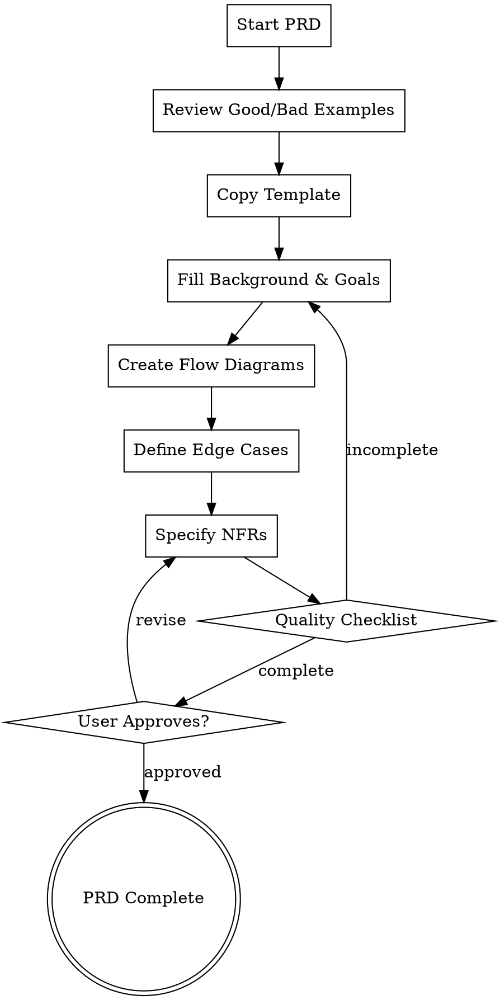

# PRD Best Practices

## Overview

**Quality standards for Product Requirements Documents (PRDs)**

This skill provides product-manager agents with:
- Clear criteria for good vs bad PRDs
- Concrete examples with analysis
- Recommended PRD template

**⚠️ MANDATORY: All PRDs must follow these standards before approval.**

## Reference Files

| File | Purpose | Location |
|------|---------|----------|
| PRD Template | Standard PRD structure | [.claude/skills/prd-best-practices/prd-template.md](.claude/skills/prd-best-practices/prd-template.md) |
| Good vs Bad Examples | Concrete PRD comparisons | [.claude/skills/prd-best-practices/prd-examples.md](.claude/skills/prd-best-practices/prd-examples.md) |

## Good PRD vs Bad PRD

### What Makes a BAD PRD

| Problem | Example | Consequence |
|---------|---------|-------------|
| **Vague user** | "Users can manage tasks" | Who? Everyone = nobody |
| **No scope boundaries** | "Add features as needed" | Scope creep inevitable |
| **Missing edge cases** | "Handle errors gracefully" | Runtime errors, bad UX |
| **No flow diagrams** | Text-only descriptions | Business logic misunderstood |
| **No priorities** | All features equal | Cannot make tradeoffs |
| **Unquantified NFRs** | "App should be fast" | Cannot verify success |
| **No acceptance criteria** | "Feature works correctly" | Cannot validate completion |

### What Makes a GOOD PRD

| Quality | Example | Benefit |
|---------|---------|---------|
| **Specific user** | "Office worker with 5-10 daily tasks" | Clear target, focused design |
| **Explicit scope** | "In: Add/Complete/Delete. Out: Login/Sync/Categories" | Prevents feature creep |
| **Edge cases covered** | "Empty list → Show 'No tasks yet' with CTA" | Robust implementation |
| **Mermaid flowcharts** | Visual decision trees | Unambiguous logic |
| **P0/P1/P2 priorities** | Clear importance levels | Enables tradeoff decisions |
| **Quantified targets** | "FCP < 1.5s, TTI < 3s" | Verifiable success |
| **Testable criteria** | "User can add task in < 5 seconds" | Clear acceptance |

## PRD Quality Checklist

Before submitting PRD for review, verify ALL items:

### Part 1: Background & Goals

- [ ] **Project Overview**: 1-2 sentences, specific scope and target
- [ ] **Target User**: Specific persona, not "everyone"
- [ ] **User Scenarios**: Time, place, and context specified
- [ ] **Pain Points**: Current problems clearly articulated (3+)
- [ ] **User Stories**: All follow "As a... I want... So that..." format
- [ ] **In-Scope**: MVP features explicitly listed
- [ ] **Out-of-Scope**: Excluded features with reasons
- [ ] **Requirements**: All have IDs, priorities, and status

### Part 2: Solution Overview

- [ ] **Core Business Flow**: Mermaid flowchart covering all paths
- [ ] **Feature Flows**: Additional flowcharts for complex features
- [ ] **Information Architecture**: Page/component hierarchy documented

### Part 3: Detailed Specifications

- [ ] **Page States**: All states defined (initial, loading, empty, error, success)
- [ ] **Interactions**: Element → Action → Result documented
- [ ] **Edge Cases**: At least 5 edge cases with handling and feedback
- [ ] **Performance**: Quantified targets with measurement methods
- [ ] **Compatibility**: Specific browser/device versions
- [ ] **Analytics**: Events, triggers, and data captured

### Part 4: Launch Plan

- [ ] **Milestones**: Target dates for each phase
- [ ] **Rollout Strategy**: Phased release plan (if applicable)

## Template Usage

**Location**: [.claude/skills/prd-best-practices/prd-template.md](.claude/skills/prd-best-practices/prd-template.md)

### Template Structure

```
Part 0: Document Information
├── Document Status (version, stage, date)
├── Key Stakeholders
└── Update History

Part 1: Background & Goals
├── 1.1 Project Overview
├── 1.2 Core Problem (User Profile, Scenarios, Pain Points)
├── 1.3 User Stories
├── 1.4 Scope Management (In-Scope, Out-of-Scope)
└── 1.5 Requirements List

Part 2: Solution Overview
├── 2.1 Core Business Flow (Mermaid)
├── 2.2 Feature Flow (additional diagrams)
└── 2.3 Information Architecture

Part 3: Detailed Specifications
├── 3.1 Page Specifications (States, Interactions, Components)
├── 3.2 Edge Cases
└── 3.3 Non-Functional Requirements

Part 4: Launch Plan
├── 4.1 Milestones
└── 4.2 Rollout Strategy

Appendix
├── Glossary
└── Related Documents
```

### How to Use Template

1. **Copy template** to `docs/prd/PRD-{project}.md`
2. **Replace bracketed placeholders** with actual content
3. **Mark uncertain items** as "TBD (待确定)"
4. **Remove placeholder text** after filling in
5. **Add project-specific sections** as needed

## Common PRD Anti-Patterns

### Anti-Pattern 1: "This Is Too Simple To Need Detailed Spec"

**Reality**: Simple projects are where unexamined assumptions cause the most wasted work.

| Assumption | Reality |
|------------|---------|
| "Just add a button" | What about loading? Error? Disabled state? |
| "Save to database" | What about validation? Conflicts? Offline? |
| "Show a list" | What about empty state? Loading? Pagination? |

### Anti-Pattern 2: "We'll Figure Out Edge Cases Later"

**Reality**: Edge cases discovered during development = rework, bugs, and delays.

**Best Practice**: Document at least 5 edge cases BEFORE implementation:
1. Empty data
2. Network failure
3. Invalid input
4. Concurrent access
5. Boundary conditions

### Anti-Pattern 3: "Requirements Are Obvious"

**Reality**: What's obvious to you may not be obvious to developers, testers, or future team members.

**Best Practice**: Write explicit acceptance criteria for every feature:
```
Given [context]
When [action]
Then [expected result]
```

## Examples Quick Reference

See [.claude/skills/prd-best-practices/prd-examples.md](.claude/skills/prd-best-practices/prd-examples.md) for detailed examples:

| Example | What It Demonstrates |
|---------|---------------------|
| Project Overview | Vague vs specific scope |
| User Stories | Generic vs role-based |
| Edge Cases | "Handle gracefully" vs specific handling |
| Flow Diagrams | Linear vs complete decision tree |
| Requirements | Flat list vs prioritized |
| Non-Functional Requirements | "Fast" vs quantified targets |

## Integration with Auto-Coding Framework

| Phase | Agent | PRD Usage |
|-------|-------|-----------|
| Phase 2 | product-manager | Creates PRD using this skill |
| Phase 2 | ux-designer | Uses PRD for UI/UX design |
| Phase 3 | architect | Uses PRD for architecture decisions |
| Phase 5 | developers | Uses PRD as implementation guide |
| Phase 7 | product-manager | Uses PRD for UAT verification |

## Process Flow



## Summary

**Good PRDs are:**
- Specific, not vague
- Quantified, not subjective
- Complete, not assumed
- Prioritized, not flat
- Visual, not text-only
- Testable, not ambiguous

**Before submitting PRD:**
1. Read [prd-examples.md](.claude/skills/prd-best-practices/prd-examples.md)
2. Use [prd-template.md](.claude/skills/prd-best-practices/prd-template.md)
3. Complete quality checklist
4. Get user approval
