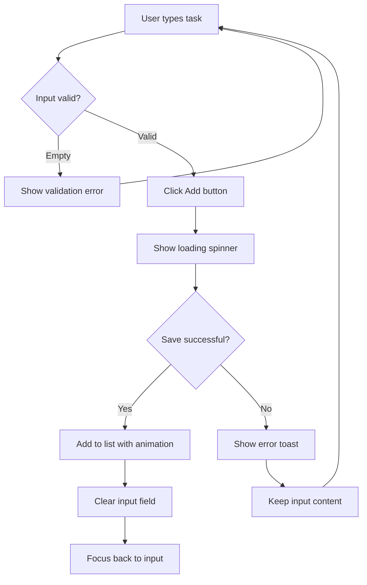

# PRD Examples: Good vs. Bad

This document provides concrete examples of well-written vs. poorly-written PRDs to illustrate best practices.

---

## Example 1: Project Overview

### Bad Example

```markdown
# Todo List

Make a todo list app where users can add and complete tasks.
```

**Problems:**
- No target user specified → may build overly complex team version
- No core features listed → may add unnecessary features
- No scope boundaries → scope creep inevitable
- No edge cases → runtime errors likely
- No flow diagrams → business logic may be misunderstood

### Good Example

```markdown
# Minimalist Todo List

## 1.1 Project Overview

A minimalist todo list web page for personal use, featuring only add and complete task functionality.

## 1.2 Core Problem

- **Target User**: Myself (office worker, handling 5-10 tasks daily)
- **User Scenario**: Morning computer startup, quickly checking today's tasks
- **Core Pain Point**: Sticky notes get lost, phone memo apps are cumbersome to open

## 1.5 Scope Management

**In-Scope**: Add task, view list, mark complete, delete task
**Out-of-Scope**: Login/registration, cloud sync, categories/tags

## 2.1 Core Business Flow

[Mermaid flowchart]

## 3.2 Edge Cases

- Rapid "Add" clicks → 500ms debounce
- Empty list → Show "No tasks yet" message
- Page refresh → Data persists (localStorage)
```

**Why this works:**
- Specific user and scenario provides clear context
- Explicit out-of-scope prevents feature creep
- Edge cases covered upfront
- Flowchart eliminates ambiguity

---

## Example 2: User Stories

### Bad Example

```markdown
Users can manage their tasks.
```

**Problems:**
- Who is "users"?
- What does "manage" mean?
- Why do they need this?

### Good Example

```markdown
| ID | Story | Priority |
|----|-------|----------|
| US-001 | As a busy professional, I want to quickly add tasks without complex forms, so that capturing ideas takes < 5 seconds | High |
| US-002 | As someone who gets satisfaction from progress, I want to check off completed tasks, so that I feel accomplished | High |
| US-003 | As a clean interface lover, I want to delete irrelevant tasks, so that my list stays focused | Medium |
```

**Why this works:**
- Specific role with characteristics
- Clear action with context
- Explicit value/benefit
- Quantifiable where possible

---

## Example 3: Edge Cases

### Bad Example

```markdown
The system should handle errors gracefully.
```

**Problems:**
- What errors?
- What is "gracefully"?
- No actionable guidance

### Good Example

```markdown
| Scenario | Handling | User Feedback |
|----------|----------|---------------|
| User clicks "Add" button twice rapidly | Debounce: only first click within 500ms is processed | Button shows loading spinner, disabled during processing |
| Network request fails | 3 retry attempts with exponential backoff, then give up | Toast: "Unable to save. Changes saved locally." |
| Task list is empty | Show empty state illustration | Message: "No tasks yet. Add your first task!" with arrow pointing to input |
| User refreshes mid-edit | Auto-save every keystroke to localStorage | On reload, restore draft with toast: "Unsaved draft restored" |
| Input exceeds 500 characters | Prevent further input, show counter | "0/500 characters remaining" turns red |
```

**Why this works:**
- Specific scenario described
- Clear technical handling
- User-facing feedback specified
- Actionable for developers

---

## Example 4: Flow Diagrams

### Bad Example

```markdown
User adds task → task appears in list
```

**Problems:**
- What about validation?
- What about loading states?
- What about errors?

### Good Example



**Why this works:**
- Shows all possible paths
- Includes validation
- Handles success and failure
- Specifies UI feedback at each step

---

## Example 5: Requirements Prioritization

### Bad Example

```markdown
Features needed:
- Add tasks
- Edit tasks
- Delete tasks
- Categories
- Due dates
- Reminders
- Collaboration
- Export to PDF
```

**Problems:**
- No priorities
- No MVP vs future distinction
- Everything seems equal

### Good Example

```markdown
### In-Scope (MVP)

| ID | Feature | Priority | Rationale |
|----|---------|----------|-----------|
| R001 | Add task | P0 | Core functionality |
| R002 | Complete task | P0 | Core functionality |
| R003 | Delete task | P1 | List hygiene |
| R004 | Persist data | P1 | Data must survive refresh |

### Out-of-Scope

| Feature | Reason | Future Consideration |
|---------|--------|---------------------|
| User accounts | Complexity vs. value for single user | v2.0 if sharing needed |
| Categories | Over-engineering for 5-10 daily tasks | v2.0 based on usage data |
| Due dates | Adds complexity, not core to MVP | v1.5 |
| Cloud sync | Requires backend, overkill for MVP | v2.0 |
```

**Why this works:**
- Clear priority levels (P0, P1)
- Rationale for decisions
- Future version mapping
- Explicit exclusions with reasoning

---

## Example 6: Non-Functional Requirements

### Bad Example

```markdown
The app should be fast and work on all browsers.
```

**Problems:**
- What is "fast"?
- What browsers specifically?
- How to verify?

### Good Example

```markdown
### Performance

| Metric | Target | Measurement Method |
|--------|--------|-------------------|
| First Contentful Paint | < 1.5s | Lighthouse audit |
| Time to Interactive | < 3s | Chrome DevTools |
| Input response | < 100ms | Manual testing |
| Bundle size | < 100KB gzipped | Build output |

### Browser Support

| Browser | Minimum Version | Notes |
|---------|-----------------|-------|
| Chrome | 90+ | Primary development browser |
| Firefox | 88+ | Test weekly |
| Safari | 14+ | Test on macOS and iOS |
| Edge | 90+ | Chromium-based only |

### Not Supported

- Internet Explorer (any version)
- Safari < 14
- Android WebView (use Chrome)
```

**Why this works:**
- Quantifiable targets
- Specific versions
- Measurement methods
- Clear exclusions

---

## Summary: PRD Quality Checklist

Before finalizing a PRD, verify:

- [ ] **User Profile**: Specific person described, not "everyone"
- [ ] **Scenarios**: Time, place, and context specified
- [ ] **Pain Points**: Current problems clearly articulated
- [ ] **User Stories**: All follow "As a... I want... So that..." format
- [ ] **Scope**: Both in-scope AND out-of-scope clearly defined
- [ ] **Flows**: Mermaid diagrams for all business logic
- [ ] **Edge Cases**: At least 5 edge cases documented
- [ ] **States**: All page states defined (initial, loading, empty, error, success)
- [ ] **NFRs**: Performance and compatibility targets quantified
- [ ] **Priorities**: All requirements have explicit priority levels
