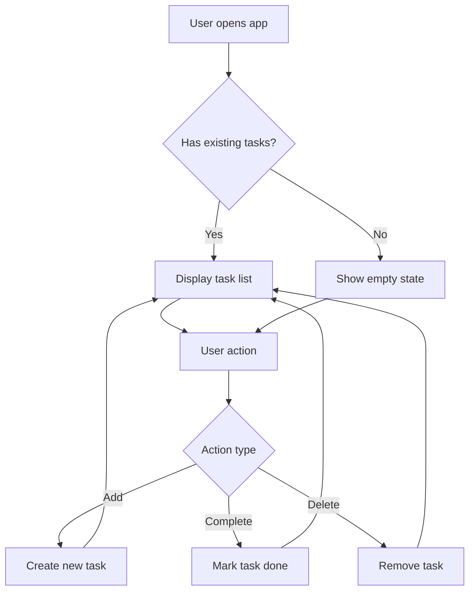

# PRD Template

Use this template when generating PRDs. Replace bracketed placeholders with actual content. Mark uncertain items as "TBD (待确定)".

---

# [Product Name]

## Part 0: Document Information

### Document Status

| Field | Value |
|-------|-------|
| Current Version | [e.g., Internal Review v1.0.0] |
| Current Stage | [Requirements Review / UI Design / Development / Live] |
| Last Updated | [YYYY-MM-DD] |

### Key Stakeholders

| Role | Name |
|------|------|
| Product Manager | [Name] |
| Tech Lead | [Name] |
| Designer | [Name] |
| QA Lead | [Name] |

### Update History

| Version | Stage | Date | Changes |
|---------|-------|------|---------|
| v1.0.0 | Initial Draft | YYYY-MM-DD | Initial background and goals |
| v1.1.0 | Middle Draft | YYYY-MM-DD | Added business flows and architecture |
| v1.2.0 | Final Draft | YYYY-MM-DD | Complete interaction specs and edge cases |

---

## Part 1: Background & Goals

### 1.1 Project Overview

[1-2 sentence description of what the product is. Be specific about scope and target.]

Example: "A minimalist todo list web app for personal use, featuring only add and complete task functionality."

### 1.2 Core Problem

#### Target User Profile

| Attribute | Description |
|-----------|-------------|
| Who | [Specific user type, not "everyone"] |
| Characteristics | [Key traits, behaviors, technical level] |
| Frequency | [How often they'll use this] |

#### User Scenarios

| Scenario | When | Where | Context |
|----------|------|-------|---------|
| Primary | [Time of day/week] | [Location/device] | [What triggers usage] |
| Secondary | [Time] | [Location] | [Context] |

#### Core Pain Points

1. **[Pain Point 1]**: [Description of current problem]
2. **[Pain Point 2]**: [Description of current problem]
3. **[Pain Point 3]**: [Description of current problem]

### 1.3 User Stories

| ID | Story | Priority |
|----|-------|----------|
| US-001 | As a [role], I want to [action], so that [value] | High |
| US-002 | As a [role], I want to [action], so that [value] | High |
| US-003 | As a [role], I want to [action], so that [value] | Medium |

### 1.4 Scope Management

#### In-Scope (MVP)

- [ ] [Feature 1]
- [ ] [Feature 2]
- [ ] [Feature 3]

#### Out-of-Scope (Explicitly NOT Included)

- [ ] [Feature A] - Reason: [Why not included]
- [ ] [Feature B] - Reason: [Why not included]
- [ ] [Feature C] - Considered for: [Future version]

### 1.5 Requirements List

| ID | Module | Description | Priority | Status |
|----|--------|-------------|----------|--------|
| R001 | [Module] | [Requirement description] | High | Planned |
| R002 | [Module] | [Requirement description] | High | Planned |
| R003 | [Module] | [Requirement description] | Medium | Planned |
| R004 | [Module] | [Requirement description] | Low | V2.0 |

---

## Part 2: Solution Overview

### 2.1 Core Business Flow



[Customize the above flowchart for your specific business logic]

### 2.2 Feature Flow

[Add additional flowcharts for complex features]

### 2.3 Information Architecture

```
[Product Name]
├── Home Page
│   ├── Navigation
│   ├── Main Content Area
│   │   ├── [Component 1]
│   │   └── [Component 2]
│   └── Footer
├── [Page 2]
│   ├── [Section 1]
│   └── [Section 2]
└── Settings (if applicable)
    ├── [Setting Group 1]
    └── [Setting Group 2]
```

---

## Part 3: Detailed Specifications

### 3.1 Page Specifications

#### Page: [Page Name]

**Page Purpose**: [Brief description of page function]

##### States

| State | Condition | Display |
|-------|-----------|---------|
| Initial | Page load | [What shows on load] |
| Loading | Data fetching | [Loading indicator description] |
| Empty | No data | [Empty state message and CTA] |
| Populated | Has data | [Normal display] |
| Error | Request failed | [Error message and recovery action] |

##### Interactions

| Element | Action | Result | Notes |
|---------|--------|--------|-------|
| [Button/Link] | Click | [What happens] | [Additional context] |
| [Input] | Submit | [Validation + action] | [Validation rules] |
| [List item] | Click | [Navigation/action] | [State changes] |

##### Component: [Component Name]

- **Location**: [Where in the page]
- **Initial State**: [Default appearance]
- **Interactions**:
  - [Trigger] → [Response]
  - [Trigger] → [Response]

### 3.2 Edge Cases

| Scenario | Handling | User Feedback |
|----------|----------|---------------|
| Rapid repeated clicks | Debounce 500ms | Button disabled during processing |
| Network timeout | 10s timeout, then error | "Network error, please retry" toast |
| Empty form submission | Block submission | Inline validation errors |
| Session expired | Redirect to login | "Session expired" notification |
| Large data set | Pagination/virtual scroll | Loading indicator |
| Browser back button | [Behavior] | [Feedback] |
| Page refresh mid-action | [Data persistence strategy] | [Recovery message] |

### 3.3 Non-Functional Requirements

#### Performance

| Metric | Target | Measurement |
|--------|--------|-------------|
| Initial Load | < 3s | First Contentful Paint |
| Interaction Response | < 100ms | Time to visual feedback |
| API Response | < 500ms | 95th percentile |

#### Compatibility

| Platform | Versions |
|----------|----------|
| Browsers | Chrome 90+, Firefox 88+, Safari 14+, Edge 90+ |
| Mobile | iOS 14+, Android 10+ |
| Screen Sizes | 320px - 2560px |

#### Analytics/Tracking

| Event | Trigger | Data Captured |
|-------|---------|---------------|
| [Event Name] | [User action] | [Data points] |
| [Event Name] | [User action] | [Data points] |

---

## Part 4: Launch Plan

### 4.1 Milestones

| Phase | Description | Target Date |
|-------|-------------|-------------|
| Requirements Review | PRD finalization | YYYY-MM-DD |
| UI/UX Design | Design completion | YYYY-MM-DD |
| Development | Feature complete | YYYY-MM-DD |
| QA Testing | Bug fixes complete | YYYY-MM-DD |
| Launch | Production release | YYYY-MM-DD |

### 4.2 Rollout Strategy

[If applicable, describe phased rollout plan]

| Phase | Audience | Percentage | Duration |
|-------|----------|------------|----------|
| Alpha | Internal team | 100% | 1 week |
| Beta | Early adopters | 10% | 2 weeks |
| GA | All users | 100% | - |

---

## Appendix

### Glossary

| Term | Definition |
|------|------------|
| [Term] | [Definition] |

### Related Documents

- [Link to Design Spec]
- [Link to Technical Spec]
- [Link to API Documentation]
