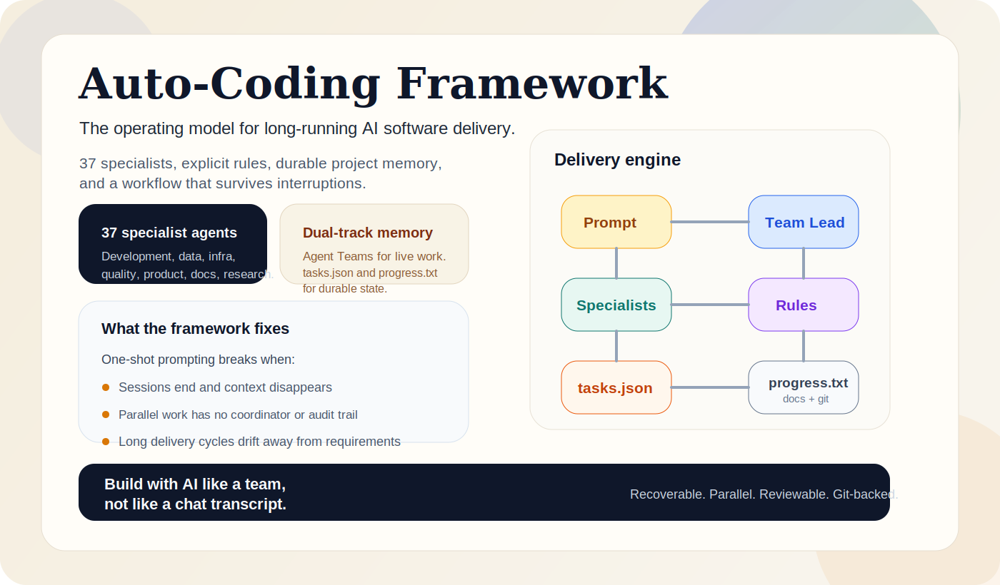
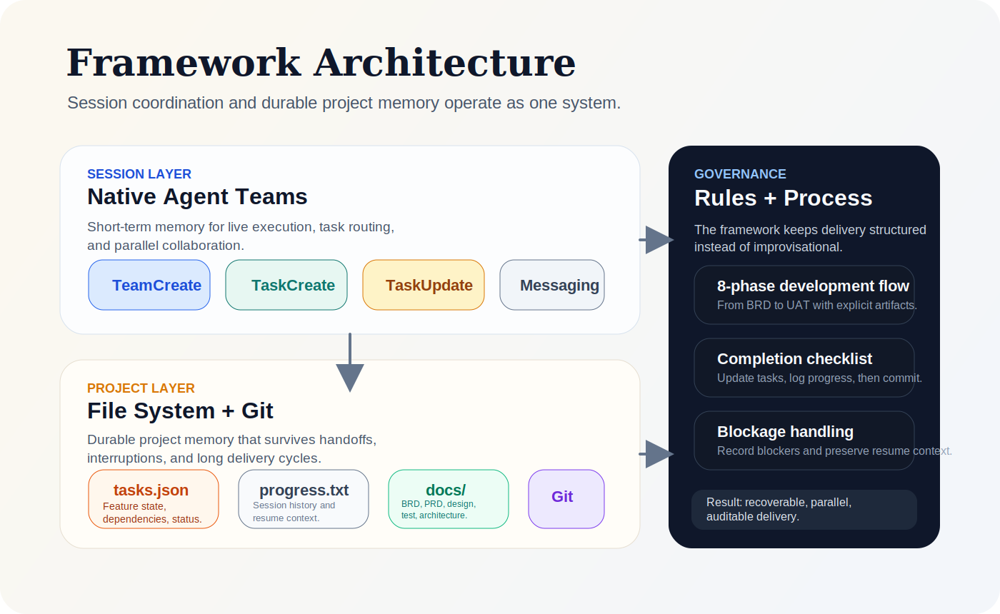
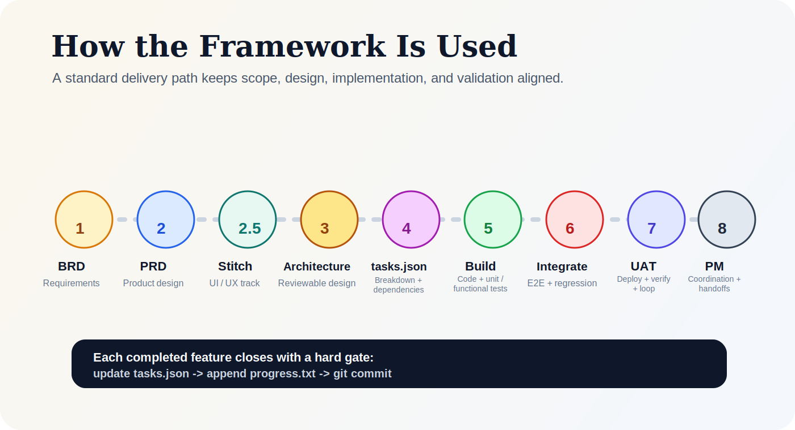
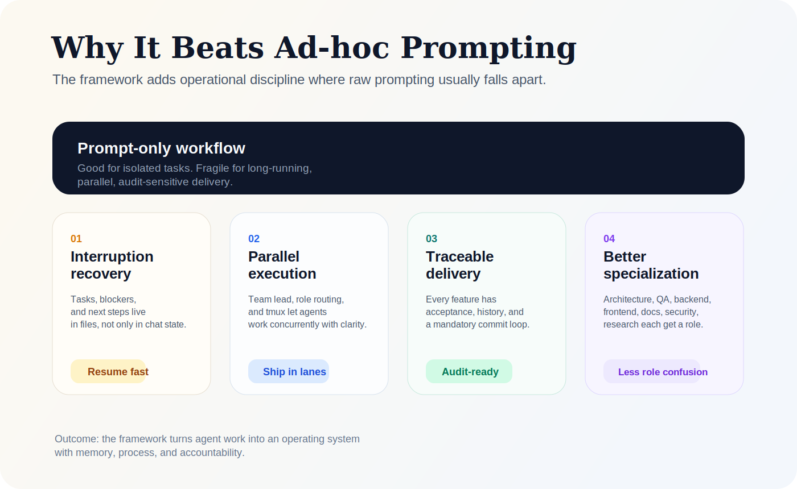

**Language Switch:**[English](README.md) | [中文](README.zh.md) 

# [LRAC]LongRunning-Auto-Coding Framework

> The operating model for long-running AI software delivery.

Auto-Coding Framework turns agent-based development into a structured system: role-based execution, durable project memory, explicit rules, and an end-to-end workflow that survives interruptions, handoffs, and parallel work.

<p align="center">
  
</p>

<p align="center">
  <strong>37 specialized agents</strong> ·
  <strong>8-phase delivery workflow</strong> ·
  <strong>Dual-track memory</strong> ·
  <strong>Git-backed traceability</strong>
</p>

## 60-Second Overview


## Why This Framework Exists

Most AI coding workflows are fast at the beginning and fragile after that. They break when:

- the session ends and context disappears
- multiple agents work in parallel without a coordinator
- long-running requirements drift away from implementation
- nobody can reconstruct what was decided, changed, or validated

This framework solves that by combining live agent coordination with persistent project state in the filesystem and Git.

## What Makes It Different

| Capability | What the framework adds |
| --- | --- |
| **Coordination** | `project-manager` acts as team lead and routes work to specialist agents |
| **Persistence** | `tasks.json` and `progress.txt` preserve state across sessions |
| **Process** | A standard path from BRD -> PRD -> Stitch -> Architecture -> Tasks -> Build -> Test -> UAT |
| **Recovery** | Blockers, resume context, and execution history are explicitly recorded |
| **Quality** | Rules, hooks, testing policies, and completion gates keep work auditable |

## Architecture

<p align="center">
  
</p>

The framework operates as three layers:

- **Session Layer**: Native Agent Teams handle live execution, task assignment, and cross-agent communication.
- **Project Layer**: Files such as `.auto-coding/tasks.json`, `.auto-coding/progress.txt`, and `docs/` store durable project memory.
- **Governance Layer**: Rules in `.claude/rules/` define how work starts, how blockers are recorded, how features close, and when commits happen.

This is what makes the system recoverable instead of conversationally fragile.

## How It Is Used

<p align="center">
  
</p>

### Delivery Flow

1. Capture requirements in BRD and PRD.
2. Use Stitch for UI/UX exploration and system-level design assets.
3. Review architecture before implementation starts.
4. Break work into `tasks.json` with dependencies and acceptance criteria.
5. Execute development with specialist agents and tests.
6. Run integration, regression, deployment, and UAT loops.
7. Close every completed feature with:
   - `tasks.json` updated
   - `progress.txt` appended
   - a Git commit created immediately

### Dual-Track Memory

| Track | Scope | Purpose |
| --- | --- | --- |
| **Native Agent Teams** | Session-level | Real-time planning, delegation, execution |
| **tasks.json / progress.txt / docs / Git** | Project-level | Cross-session state, traceability, recovery |

## Why It Outperforms Ad-hoc Prompting

<p align="center">
  
</p>

| Prompt-only workflow | Auto-Coding Framework |
| --- | --- |
| Context is mostly trapped in chat history | Context is preserved in files and Git |
| Parallel work becomes ambiguous | Roles and team lead coordination are explicit |
| Feature completion is easy to lose track of | Acceptance, execution history, and completion gates are mandatory |
| Recovery after interruption is manual | Resume context and blockers are part of the workflow |


## Agent System

The framework ships with **37 specialized agents** across seven categories:

| Category | Count | Example roles |
| --- | --- | --- |
| Core Development | 10 | `architect`, `frontend-dev`, `backend-dev`, `fullstack-dev` |
| Data & AI | 8 | `data-engineer`, `llm-architect`, `ai-engineer` |
| Infrastructure | 2 | `devops-engineer`, `mcp-developer` |
| Quality & Security | 8 | `code-reviewer`, `security-auditor`, `test-engineer` |
| Business & Product | 4 | `project-manager`, `product-manager`, `business-analyst` |
| Documentation | 2 | `technical-writer`, `api-documenter` |
| Research & Orchestration | 3 | `researcher`, `market-researcher`, `agent-organizer` |

Full agent specs: [`.claude/agents/AGENTS.md`](.claude/agents/AGENTS.md)

## Phase-Skills Intergrated

**Each phase has associated skills that MUST be invoked when entering that phase:**

| Phase | Required Skill | When to Invoke | How |
|-------|---------------|----------------|-----|
| **1-2** | `brainstorming` | When receiving new feature request | `Skill("brainstorming")` |
| **2.5** | `ui-ux-pro-max` → `enhance-prompt` → `stitch-loop` → `design-md` → `shadcn-ui` | When creating UI/UX design | Invoke skills in sequence |
| **3-4** | `writing-plans` | When BRD/PRD approved, creating architecture | `Skill("writing-plans")` |
| **5** | `executing-plans` | When starting implementation | `Skill("executing-plans")` |
| **5** | `tdd-enforcement` | Before writing ANY production code | `Skill("tdd-enforcement")` |
| **5-6** | `systematic-debugging` | When encountering bugs/test failures | `Skill("systematic-debugging")` |
| **5-7** | `fix` | When fixing lint/format issues, before commit | `Skill("fix")` |
| **5-7** | `verification-before-completion` | Before claiming work is complete | `Skill("verification-before-completion")` |
| **7** | `finishing-development-branch` | When implementation complete, ready to merge | `Skill("finishing-development-branch")` |
| **5-8** | `dispatching-parallel-agents` | When facing 2+ independent tasks | `Skill("dispatching-parallel-agents")` |


## IMAC Command

Use `/IMAC` for iterative evolution of existing projects (Install, Modify, And, Change).

- Command file: `.claude/commands/IMAC.md`
- Runs intake interaction with single-select and multi-select questions
- Automatically detects the earliest restart phase (Phase 1/2/2.5/3/4/5+)
- Performs impact analysis before implementation
- Appends records to `.auto-coding/progress.txt` and `docs/CHANGELOG.md`

Typical examples:

- `/IMAC` → starts intake and usually restarts from PRD or Design based on answers
- `/IMAC architecture migrate frontend to XX` → usually restarts from Phase 3

### Task ID Convention

In `.auto-coding/tasks.json`, every `features[].id` must follow:

`{iteration}-{phaseSymbol}-{NNN}`

- `iteration`: `inital` or `imac-{abbr}`
- `phaseSymbol`: `p1r` `p1b` `p2p` `p25d` `p3a` `p4b` `p5d` `p6t` `p7d` `p8m`
- `NNN`: 3-digit sequence (`001`, `002`, ...)


## Stitch UI / UX Track

The framework includes a dedicated UI/UX lane between product and architecture:

```text
ui-ux-pro-max -> enhance-prompt -> stitch-loop -> design-md -> shadcn-ui
```

Expected outputs:

- `.stitch/next-prompt.md`
- `.stitch/designs/*.html`
- `.stitch/designs/*.png`
- `.stitch/DESIGN.md`
- `docs/design/UI-SPEC-*.md`

This gives the engineering team visual prototypes and component-level specifications before coding the interface.

## Quick Start

### Prerequisites

- **Claude Code**: This framework runs on [Claude Code](https://claude.ai/code), Anthropic's official CLI for Claude.
- **Stitch API Key**: For UI/UX design generation (Phase 2.5), get your API key from [stitch.withgoogle.com/settings](https://stitch.withgoogle.com/settings) ，Please save the key that will be requested during the project init.sh phase.

### 1. Create a New Project

```bash
chmod +x setup.sh
./setup.sh new ../your-project
cd ../your-project
```

This creates the framework structure in a new repository and initializes the project-state files.

### 2. Initialize the Environment

```bash
chmod +x init.sh
./init.sh
```

`init.sh` is designed to:

- install project dependencies
- check environment prerequisites
- validate core framework readiness

### 3. Enable Agent Teams

```bash
export CLAUDE_CODE_EXPERIMENTAL_AGENT_TEAMS="1"
```

Or launch Claude inline:

```bash
CLAUDE_CODE_EXPERIMENTAL_AGENT_TEAMS=1 claude
```

### 4. Give Claude a Real Project Goal

```bash

# in you project fold, Run: Claude & provide prompt.

I want to build “a financial news aggregation platform”.
Use project-manager as the team lead.
Follow the framework phases and maintain tasks.json and progress.txt.
```

That is enough to start a structured delivery cycle.


This rule is not optional. It is the core mechanism that makes the framework traceable and recoverable.

## Reset the Current Project

To clear project data while keeping the framework:

```bash
chmod +x setup.sh
./setup.sh reset
```

## Upgrade Framework in an In-Flight Project

When this framework repository is updated, upgrade an existing project with:

```bash
chmod +x setup.sh
./setup.sh upgrade ../your-existing-project
```

You can also run upgrade in the current directory:

```bash
./setup.sh upgrade
```

`upgrade` syncs framework-layer files (`.claude`, `.auto-coding/config`, scaffold scripts/docs) while preserving project-state files such as:

- `.auto-coding/tasks.json`
- `.auto-coding/progress.txt`
- Existing project docs outputs and source code

After upgrade, run in the target project:

```bash
./init.sh
npm run typecheck
npm run lint
```

## Recommended Parallel Setup

<p align="center">
  
</p>

For the best multi-agent workflow on macOS, use **iTerm2 + tmux**:
```bash
# Method 1: Start fresh tmux session with iTerm2 integration
tmux -CC

# Inside tmux, start Claude Code
claude --teammate-mode tmux

# Prompt Claude to create parallel agents:
# "According to the project rules, create a "news aggregation page".
#  Run TeamAgents with project-manager as team-lead.
#  Use --teammate-mode tmux for multi-pane execution."

# Agents will be allocated to separate panes:
# ├── project-manager (team-lead)
# ├── backend-dev (API development)
# ├── frontend-dev (UI development)
# └── test-engineer (test automation)
```

### tmux Key Bindings (iTerm2 -CC Mode)

In iTerm2's tmux integration mode (`-CC`), tmux panes appear as native iTerm2 tabs/windows:

| Action | How |
|--------|-----|
| **Split Pane Horizontally** | iTerm2: `Cmd+D` or tmux: `Ctrl+B %` |
| **Split Pane Vertically** | iTerm2: `Cmd+Shift+D` or tmux: `Ctrl+B "` |
| **Switch Panes** | iTerm2: `Cmd+Opt+Arrow` or tmux: `Ctrl+B Arrow` |
| **Close Pane** | iTerm2: `Cmd+W` or tmux: `Ctrl+B x` |
| **Detach Session** | tmux: `Ctrl+B d` (session keeps running) |
| **List Sessions** | `tmux ls` |

### Session Persistence

```bash
# Detach from session (keeps running)
# or tmux detach
Ctrl+B d

# Reattach later (even after reboot if using tmux-resurrect)
# or tmux -CC a
tmux -CC attach

# List all sessions
tmux ls

# Reattah target session ( -d detach current session)
# tmux -CC a -t your_session
tmux -CC attach -t your_session

# List all sessions and select 
Ctrl+B s

# Kill current session
exit

# Kill specific session
tmux kill-session -t session-name

# Kill all sessions
tmux kill-server
```

Tips

1. **Use descriptive session names**: `tmux -CC new -s my-project`
2. **Save session layout**: Use tmux-resurrect plugin for session persistence across reboots
3. **Monitor all agents**: In iTerm2, use `Cmd+Shift+I` for broadcast input to all panes
4. **Scroll history**: In -CC mode, use normal iTerm2 scrolling (`Cmd+Up` or trackpad)
5. **Tmux quick reference**: https://tmuxcheatsheet.com/

### Why this setup works well:

- each agent gets its own pane
- sessions survive terminal restarts
- output stays isolated and easier to monitor
- iTerm2 provides native pane and tab management in `-CC` mode

## Feature Completion Rules

Every completed feature must follow this order:

```text
1. Update tasks.json
2. Append progress.txt
3. Create a Git commit
```

## Testing and Verification

The framework includes built-in validation scripts:

```bash
node .claude/scripts/run-tests.js
node .claude/scripts/run-tests.js --hooks
node .claude/scripts/run-tests.js --config
```

You can also verify skills and MCP readiness through:

```bash
node .claude/scripts/check-skills.js
node .claude/scripts/check-mcp.js
```

## Media Assets

README visuals live in [`docs/design/readme-assets/`](docs/design/readme-assets/).

- Hero graphic: [`docs/design/readme-assets/framework-hero.svg`](docs/design/readme-assets/framework-hero.svg)
- Architecture graphic: [`docs/design/readme-assets/framework-architecture.svg`](docs/design/readme-assets/framework-architecture.svg)
- Workflow graphic: [`docs/design/readme-assets/framework-workflow.svg`](docs/design/readme-assets/framework-workflow.svg)
- Advantages graphic: [`docs/design/readme-assets/framework-advantages.svg`](docs/design/readme-assets/framework-advantages.svg)
- Video source page: [`docs/design/readme-assets/framework-intro.html`](docs/design/readme-assets/framework-intro.html)
- Video output: [`docs/design/readme-assets/framework-intro.webm`](docs/design/readme-assets/framework-intro.webm)
- GIF preview: [`docs/design/readme-assets/framework-intro-preview.gif`](docs/design/readme-assets/framework-intro-preview.gif)

Regenerate the video with:

```bash
npm run docs:video
```

Regenerate the GIF preview with:

```bash
npm run docs:gif
```

## Related Docs

- [`AGENTS.md`](AGENTS.md) - framework overview and quick reference
- [`CLAUDE.md`](CLAUDE.md) - full framework specification
- [`.claude/rules/`](.claude/rules/) - operational rules
- [`.claude/agents/AGENTS.md`](.claude/agents/AGENTS.md) - agent catalog
- [`.auto-coding/LESSONS_LEARNED.md`](.auto-coding/LESSONS_LEARNED.md) - retained lessons and best practices
