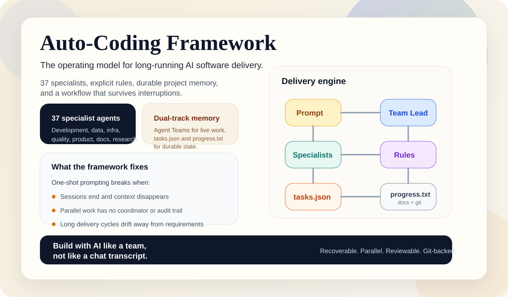
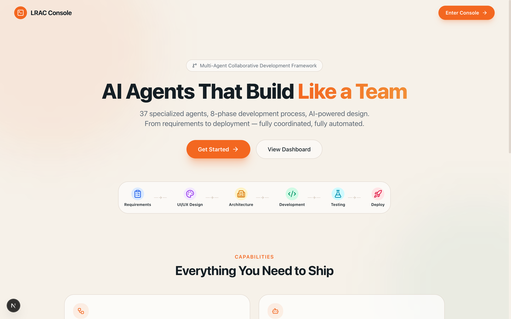
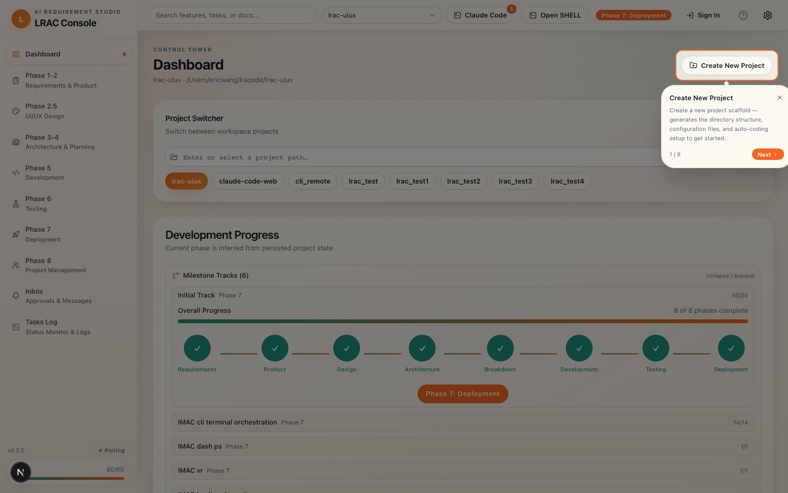
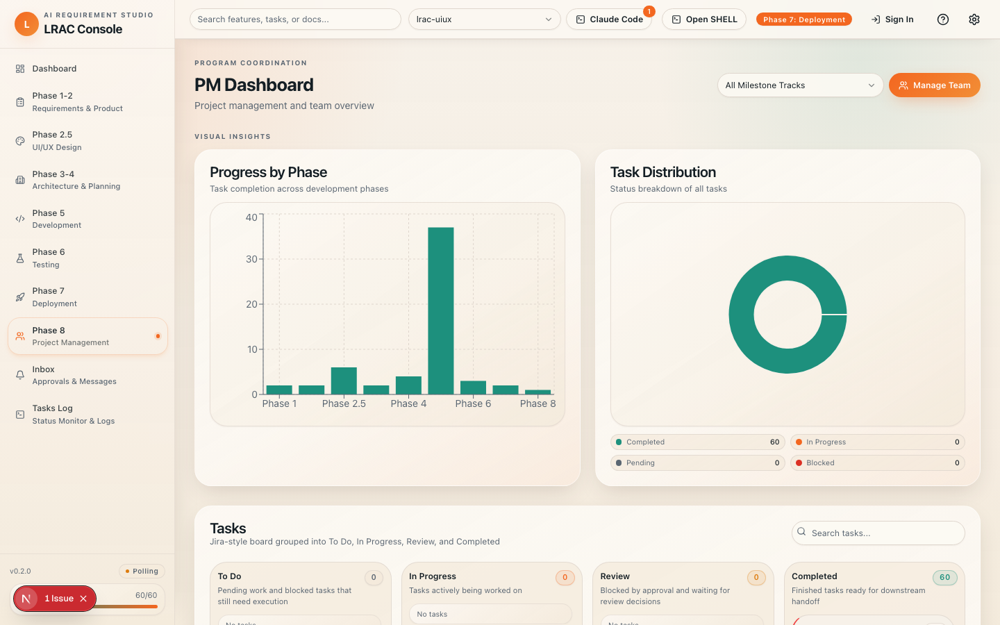
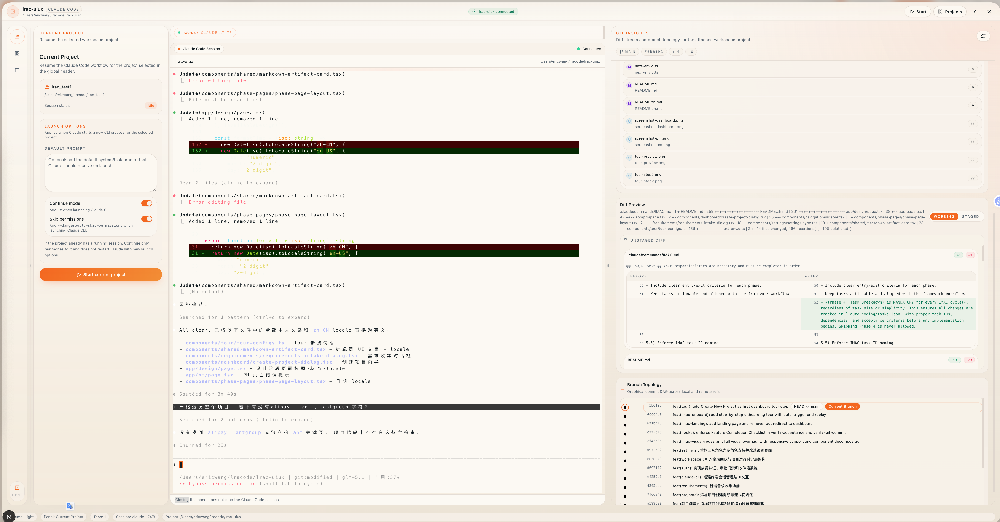

**语言切换:** [English](README.md) | [中文](README.zh.md)

# LRAC UIUX 控制台

> [LRAC 长周期自动编码框架](https://github.com/ericwanghp/LRAC)的操作界面。

[](https://github.com/ericwanghp/LRAC)

LRAC 定义的是长周期 AI 交付"该怎么做"。这个仓库定义的是"人和 Agent 怎么真正把它跑起来"——通过结构化页面、角色导向工作流和运行态 API。

## 界面截图

### 落地页



### Dashboard — 任务总控台



### PM / 交付运营视图



### Claude Code 工作区



## 这个控制台解决什么问题

长周期 AI 交付中的典型痛点：

| 痛点 | 控制台如何解决 |
|------|---------------|
| 状态分散在文件和聊天记录中 | Dashboard 优先可见，实时读取 `.auto-coding` 数据 |
| PM / QA / 工程视角割裂 | 角色导向页面共享同一项目上下文 |
| 审批、阻塞、终端动作难审计 | 专用 `/approval`、`/terminal`、`/inbox` 页面 |
| 跨项目导航弱 | 全局项目切换器，持久化上下文 |

## 前端动线图

```text
┌─────────────────────────────────────────────────────────────────────┐
│                         落地页 (/)                                   │
│   Hero → 特性介绍 → 工作原理 → 截图展示 → 行动召唤                   │
└───────────────────────────┬─────────────────────────────────────────┘
                            │
              ┌─────────────┼─────────────────┐
              ▼             ▼                  ▼
     ┌────────────┐  ┌───────────┐   ┌──────────────┐
     │  Dashboard │  │   设置    │   │    收件箱     │
     │ /dashboard │  │ /settings │   │   /inbox     │
     └─────┬──────┘  └───────────┘   └──────────────┘
           │
     ┌─────┴──────────────────────────────────────────────┐
     │              阶段轨道页面                            │
     │  ┌──────────────┐  ┌───────────────┐               │
     │  │   需求分析   │  │    设计       │               │
     │  │ /requirements│  │    /design    │               │
     │  └──────────────┘  └───────────────┘               │
     │  ┌──────────────┐  ┌───────────────┐               │
     │  │   架构设计   │  │   开发执行    │               │
     │  │ /architecture│  │ /development  │               │
     │  └──────────────┘  └───────────────┘               │
     │  ┌──────────────┐  ┌───────────────┐               │
     │  │    测试      │  │    部署       │               │
     │  │   /testing   │  │  /deployment  │               │
     │  └──────────────┘  └───────────────┘               │
     └─────────────────────────────────────────────────────┘
           │
     ┌─────┴──────────────────────────────────────────────┐
     │           运营与协同                                 │
     │  ┌──────────────┐  ┌───────────────┐               │
     │  │   PM 视图    │  │    审批       │               │
     │  │     /pm      │  │   /approval   │               │
     │  └──────────────┘  └───────────────┘               │
     │  ┌──────────────┐  ┌───────────────┐               │
     │  │   终端       │  │      QA       │               │
     │  │   /terminal  │  │      /qa      │               │
     │  └──────────────┘  └───────────────┘               │
     │  ┌──────────────┐                                   │
     │  │  任务日志    │                                   │
     │  │  /tasks-log  │                                   │
     │  └──────────────┘                                   │
     └─────────────────────────────────────────────────────┘
```

## 核心体验

### 1）Dashboard 作为任务总控台

- 阶段进度条、完成率、阻塞状态、分支上下文
- 项目切换器（全局项目上下文持久化）
- 从 `tasks.json` / `progress.txt` / session 数据提取的项目记忆快照

### 2）阶段轨道页面

这些页面把 LRAC 8 阶段交付模型落成可操作工作流：

| 路由 | 阶段 | 用途 |
|------|------|------|
| `/requirements` | Phase 1-2 | BRD / PRD 查看与编辑 |
| `/design` | Phase 2.5 | Stitch 设计查看与资源浏览 |
| `/architecture` | Phase 3 | 架构文档查看 |
| `/development` | Phase 5 | 代码跟踪与任务执行 |
| `/testing` | Phase 6 | 测试策略与结果 |
| `/deployment` | Phase 7 | 部署状态与 UAT 验证 |
| `/qa` | Phase 6-7 | QA 会话管理 |


## 项目定位

LRAC 有两个核心：

| 核心 | 仓库 | 聚焦点 |
|------|------|--------|
| **框架** | [ericwanghp/LRAC](https://github.com/ericwanghp/LRAC) | 规则、阶段、Agent、记忆、治理 |
| **UIUX（本仓库）** | [ericwanghp/LRAC-UIUX](https://github.com/ericwanghp/LRAC-UIUX) | 信息架构、交互流程、运营页面 |

## 架构

```text
┌───────────────────────────────────────────────────────────────────┐
│                     浏览器（Next.js SSR）                          │
├───────────┬───────────┬───────────┬───────────┬───────────────────┤
│  落地页   │ Dashboard │  阶段     │  运营     │    设置           │
│    /      │ /dashboard│  页面     │  页面     │  /settings        │
│           │           │           │  /pm      │                   │
│           │           │           │  /approval│                   │
│           │           │           │  /terminal│                   │
├───────────┴───────────┴───────────┴───────────┴───────────────────┤
│                       API 路由 (/api/*)                           │
├───────────────────────────────────────────────────────────────────┤
│                    lib/ 领域层                                     │
│           文件操作 · 校验 · 类型 · 工具函数                         │
├───────────────────────────────────────────────────────────────────┤
│                  .auto-coding/ 运行态数据                           │
│         tasks.json · progress.txt · config · docs                 │
└───────────────────────────────────────────────────────────────────┘
```

## 前置条件

- **Claude Code CLI** — 本项目依赖本机安装的 Claude Code CLI 作为多 Agent 编排、阶段执行和 Hook 执行的运行时。安装方式见 [claude.ai/code](https://claude.ai/code)。

## 快速开始

```bash
npm install
npm run dev
```

打开：
- `http://localhost:3000` — 落地页
- `http://localhost:3000/dashboard` — 任务总控台
- `http://localhost:3000/pm` — PM 运营视图

### 质量校验命令

```bash
npm run lint
npm run typecheck
```


## 相关链接

- [LRAC 框架](https://github.com/ericwanghp/LRAC) — 本控制台所操作的框架
- [CLAUDE.md](CLAUDE.md) — AI Agent 完整框架规范
- [AGENTS.md](.claude/agents/AGENTS.md) — Agent 目录与角色定义
