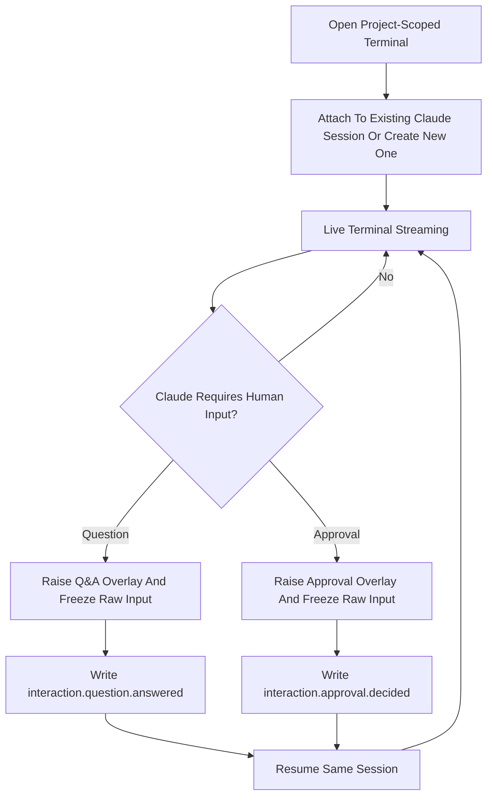
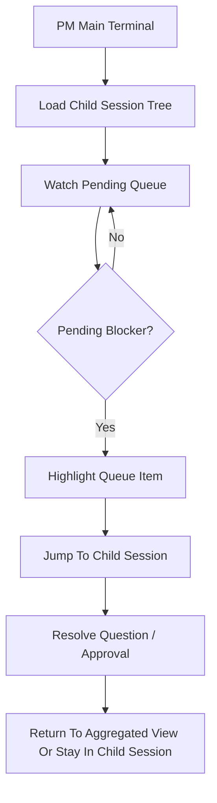

# PRD: Hybrid Claude Terminal Workbench

**Document Type**: Product Requirements Document  
**Project**: lrac-uiux  
**Iteration**: imac-cli-terminal-orchestration  
**Phase**: 2 - Product Design  
**Created**: 2026-03-22  
**Status**: Draft  
**Chosen Direction**: Option C - Hybrid Mode

---

## Part 0: Document Information

### 0.1 Stakeholders

- Product owner / primary user
- PM supervising long-running agents
- Developer continuing Claude-driven implementation
- Framework maintainer responsible for session/event infrastructure

### 0.2 Related Documents

- [Competitive Analysis](../research/COMPETITIVE-ANALYSIS-imac-cli-terminal-orchestration.md)
- [BRD](../brd/BRD-imac-cli-terminal-orchestration.md)
- [Architecture Draft](../architecture/ARCH-imac-cli-terminal-orchestration.md)
- [UI Spec Draft](../design/UI-SPEC-imac-terminal-orchestration.md)

### 0.3 Product Decision

The terminal redesign will follow **Hybrid Mode C**:

- the center of the screen behaves like a real Claude coding terminal
- structured interruptions (Q&A / approval) temporarily take over input control
- the same session resumes after the interruption is resolved
- PM still gets queue, session tree, and cross-session visibility

---

## Part 1: Background & Goals

### 1.1 Project Overview

Redesign `/terminal` from a replay-oriented execution monitor into a **browser-based Claude workbench** that lets users continue AI project delivery as if they had opened `claude -c` locally, while still supporting structured product workflows such as Q&A, approval, and PM supervision.

### 1.2 Core Problem

#### Target User

- **Primary user**: PM / technical lead / developer driving long-running AI delivery across multiple project tasks
- **Usage mode**: returns to the browser to continue, supervise, or unblock an ongoing Claude session

#### Core Scenarios

1. User opens a project and resumes the active Claude session without dropping context
2. Claude is coding in a child session and needs a product answer
3. Claude requests approval before continuing a risky or high-impact action
4. PM monitors several child sessions and jumps into the blocked one

#### Pain Points

1. Current terminal is closer to a log viewer than a real interactive session
2. Input/output continuity is weak; it does not feel like resuming `claude -c`
3. Q&A and approval are visible, but not treated as true control interruptions
4. PM aggregation exists in fragments, not as a coherent command center model
5. Users cannot easily tell whether Claude, the human, or the system currently owns the next action

### 1.3 User Stories

```
As a developer,
I want to continue an existing Claude session in the browser,
So that I can keep the project moving without dropping back to a local terminal window.

As a product owner,
I want question and approval requests to interrupt me with focused UI cards,
So that I can answer quickly without reading raw logs.

As a PM,
I want to see which child sessions are blocked, waiting, or live,
So that I can triage parallel work in seconds.

As a reviewer,
I want every interruption and response to be written back to the same session timeline,
So that the full delivery story remains auditable and replayable.
```

### 1.4 Scope

#### In Scope

- Persistent Claude task session in browser
- PTY-like live terminal experience with ongoing input/output continuity
- Session reconnect and replay after refresh
- Structured Q&A interruption overlay
- Structured approval interruption overlay
- Input freeze / resume mechanics during pending interruption
- PM main terminal with child session list, pending queue, and blocker visibility
- Project-scoped session routing

#### Out of Scope

- General-purpose unrestricted shell replacement
- Full collaborative multi-user editing
- External Slack/Feishu/Teams adapter implementation in this iteration
- In-browser source code editor
- Arbitrary agent vendor abstraction in V1

### 1.5 Requirements List

| ID | Requirement | Priority | Status |
| --- | --- | --- | --- |
| PR-001 | Browser terminal must preserve session continuity and feel like an ongoing Claude session | P0 | Proposed |
| PR-002 | Structured Q&A must interrupt the session through a dedicated UI card | P0 | Proposed |
| PR-003 | Structured approval must interrupt the session through a dedicated UI card | P0 | Proposed |
| PR-004 | Terminal input must freeze while a blocking interruption is unresolved | P0 | Proposed |
| PR-005 | Session header must show ownership, status, feature, phase, and project scope | P0 | Proposed |
| PR-006 | PM main view must expose child session tree and pending queue | P1 | Proposed |
| PR-007 | Users must be able to jump from aggregated queue item to exact child-session event | P1 | Proposed |
| PR-008 | Timeline must support replay, search, and sequence-consistent incremental loading | P1 | Proposed |
| PR-009 | Human-routing event type must remain reserved in the data model | P2 | Proposed |

---

## Part 2: Solution Overview

### 2.1 Core Business Flow



### 2.2 PM Aggregation Flow



### 2.3 Information Architecture

#### A. PM Main Terminal

- Left: child session tree with project/task grouping
- Center: aggregated timeline and current focus panel
- Right: waiting inbox for Q&A / approval / blockers

#### B. Task Child Terminal

- Top: session header
- Center: live terminal viewport
- Bottom: Claude input composer
- Overlay: blocking Q&A or approval card
- Side rail: recent interruptions and task context

### 2.4 Design Principles

1. **Terminal first**: users should trust the center pane as the real working surface
2. **Interruptions are explicit**: if human input is required, ownership visibly changes
3. **Context never disappears**: terminal stream stays visible behind interruption UI
4. **One session, one story**: raw output and structured decisions belong to the same timeline

---

## Part 3: Detailed Specifications

### 3.1 Page / Surface Specifications

#### Surface 1: Task Child Terminal

**Purpose**: continue an active Claude session for a specific task or feature.

**Core components**:

- Session identity bar
- Connection / ownership state badge
- Live terminal viewport
- Prompt composer
- Pending interruption overlay
- Context rail (feature, owner, phase, latest blocker)

**Primary states**:

- `connecting`
- `live`
- `waiting_question`
- `waiting_approval`
- `paused`
- `offline`
- `crashed`

**Key interactions**:

| Element | Action | Result |
| --- | --- | --- |
| Prompt composer | Submit message | Appends `terminal.command.submitted`, sends input to active session |
| Terminal stream | Receive output | Appends `terminal.output.appended` incrementally |
| Question overlay | Submit answer | Writes `interaction.question.answered`, unfreezes input |
| Approval overlay | Approve / Reject | Writes `interaction.approval.decided`, unfreezes input |
| Session header | Reconnect / Resume | Attempts to reattach to the same session |
| Context rail | View latest blocker | Focuses the latest interruption event |

#### Surface 2: PM Main Terminal

**Purpose**: supervise multiple child sessions and triage blockers quickly.

**Core components**:

- Project-scoped session tree
- High-priority pending queue
- Aggregated timeline
- Focus preview of selected child session

**Primary states**:

- `empty`
- `live`
- `pending_items`
- `degraded`

**Key interactions**:

| Element | Action | Result |
| --- | --- | --- |
| Session tree row | Open child session | Navigates to child terminal and preserves project scope |
| Queue item | Open blocker | Scrolls or jumps to exact interruption |
| Aggregated filter | Filter by type | Reduces noise for PM triage |
| Session status badge | Inspect session | Shows current owner, age, and last activity |

### 3.2 Interruption Rules

#### Question Interruption

- Triggered by canonical `interaction.question.raised`
- Raw terminal input becomes disabled
- Q&A card opens over the live terminal
- User can answer, defer, or route later in future iterations
- On submit, the answer is written as an immutable event and the session resumes

#### Approval Interruption

- Triggered by canonical `interaction.approval.requested`
- Raw terminal input becomes disabled
- Approval card shows scope, rationale, and impact summary when available
- User can approve or reject with optional note
- Decision is written as immutable event and the session resumes

### 3.3 Edge Cases

1. **Refresh during pending interruption**
   - Overlay must restore after reload because the pending state lives in the event stream, not only in client memory.
2. **Duplicate interruption event**
   - UI must deduplicate by `eventId` and keep a single active card.
3. **Session produces output while overlay is open**
   - Stream can continue visually, but input remains frozen until the blocking event is resolved.
4. **Project switch while session is live**
   - Current project-scoped URL must change and child-session data must be cleared before loading the new project.
5. **Session crash during pending approval**
   - UI shows `crashed` state and preserves the unresolved approval card/history.
6. **Long output flood**
   - Viewport must virtualize rows and incrementally fetch older history.
7. **User submits empty answer**
   - Validation blocks submit and keeps focus in the overlay.

### 3.4 Non-Functional Requirements

| Category | Requirement |
| --- | --- |
| Responsiveness | New output should appear in under 300 ms from backend emission under local development conditions |
| Recovery | Refresh or reconnect should restore visible session history and any active blocking interruption |
| Ordering | Events must be rendered in deterministic `session_id + seq_no` order |
| Performance | UI must remain usable with 10,000+ log rows through virtualization or incremental rendering |
| Safety | Browser cannot execute arbitrary commands directly; execution remains server-side and policy-guarded |
| Auditability | Every human decision becomes a persistent immutable event |

### 3.5 Analytics / Tracking

- session attached
- session resumed
- question raised
- question answered
- approval requested
- approval approved
- approval rejected
- queue item opened
- child session jumped from PM view

---

## Part 4: Launch Plan

### 4.1 Milestones

| Milestone | Scope | Target Outcome |
| --- | --- | --- |
| M1 | Real persistent Claude session surface | Browser terminal feels like ongoing `claude -c` |
| M2 | Blocking Q&A / approval overlays | Human interruption loop is complete |
| M3 | PM main terminal aggregation | Child session tree and pending queue are coherent |
| M4 | Replay / recovery hardening | Refresh, reconnect, and crash states are resilient |

### 4.2 Rollout Strategy

1. Replace the current fake-terminal mental model with a persistent session model
2. Turn question and approval into blocking interaction states
3. Unify PM, sidebar, and task terminal under the same project-scoped session graph
4. Harden long-session replay and recovery behavior before broader feature expansion

---

## Appendix

### Glossary

- **Child session**: terminal session bound to one task/feature
- **PM main terminal**: aggregated supervision view across child sessions
- **Blocking interruption**: Q&A or approval event that freezes raw terminal input until resolved
- **Ownership state**: whether the next action belongs to Claude, human, or system

### Acceptance Summary

- User can continue the same Claude session from the browser without losing context
- Q&A and approval interrupt the terminal through focused UI rather than passive log entries
- PM can identify and jump to blockers quickly
- Session replay after refresh preserves both raw terminal output and structured decisions
